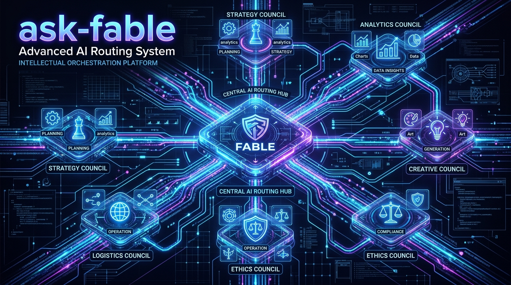
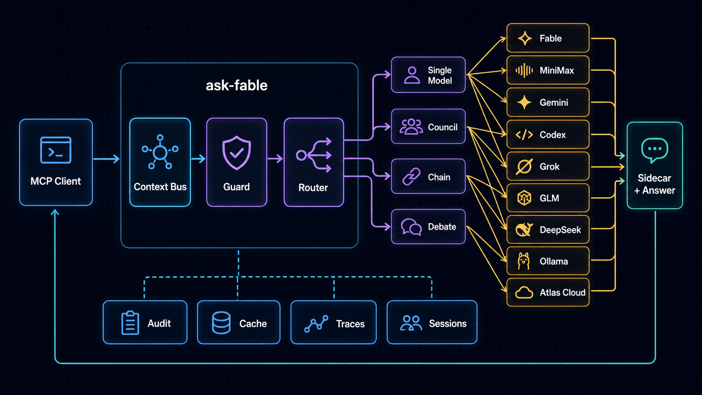
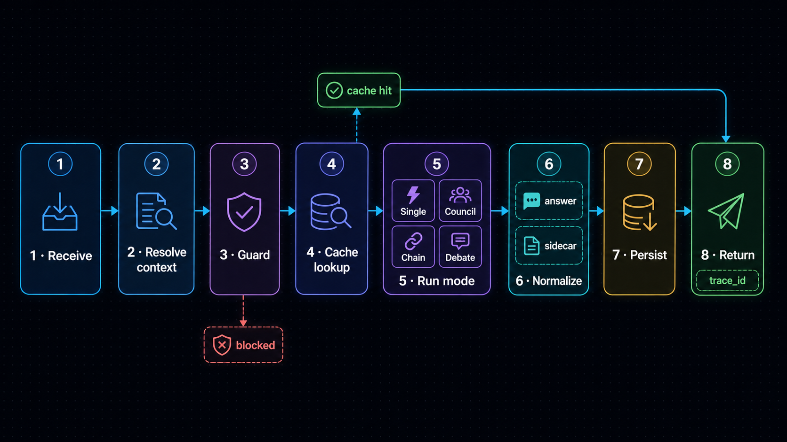
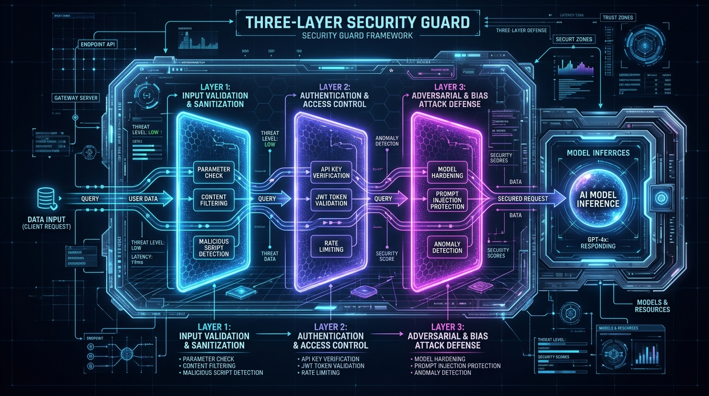
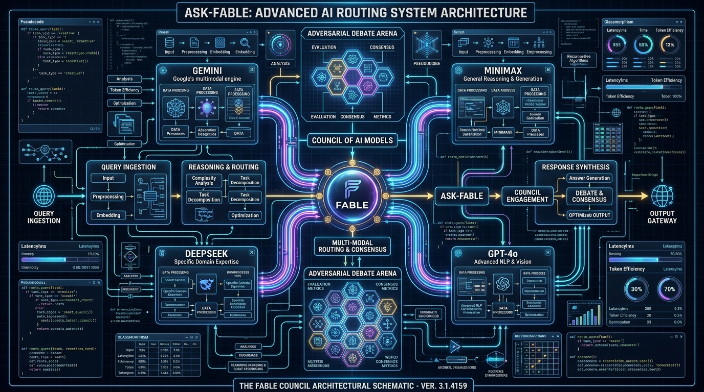
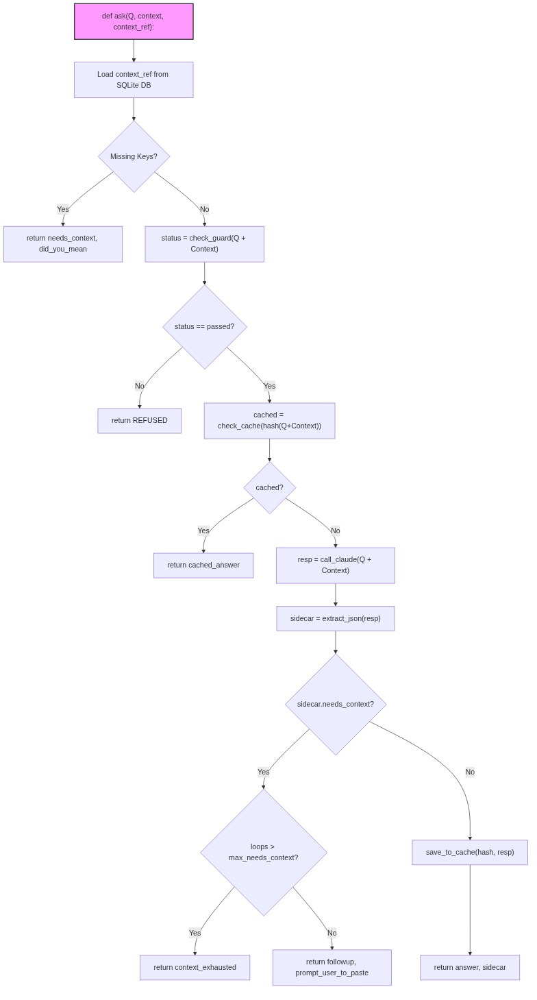
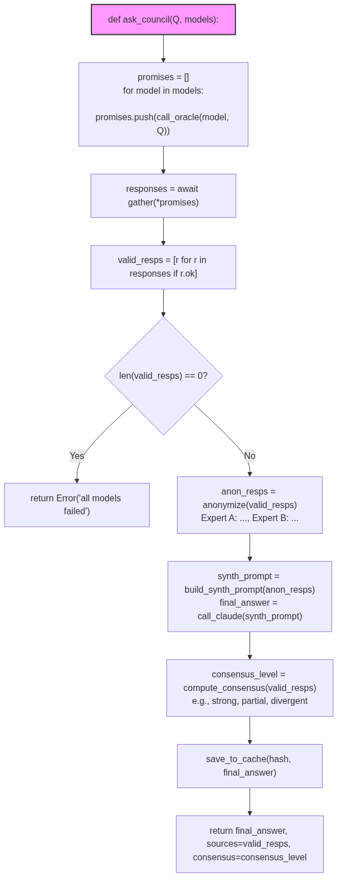
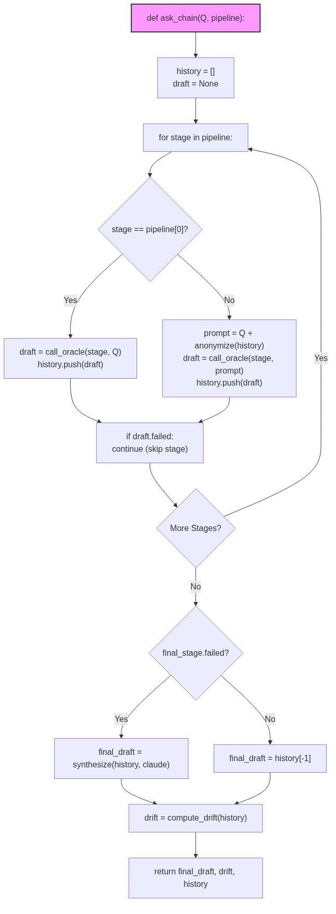
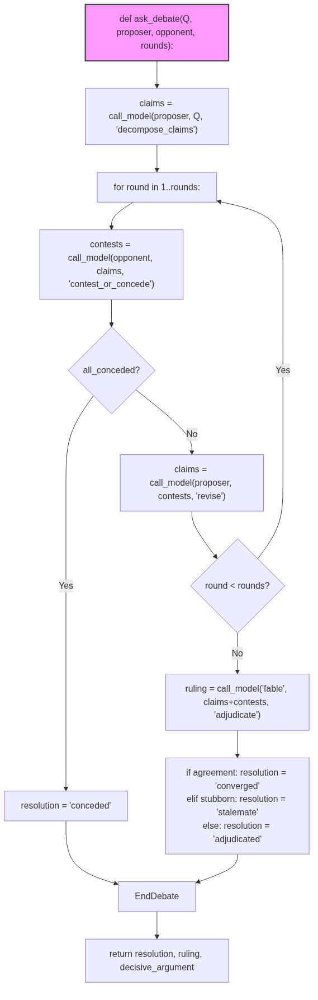
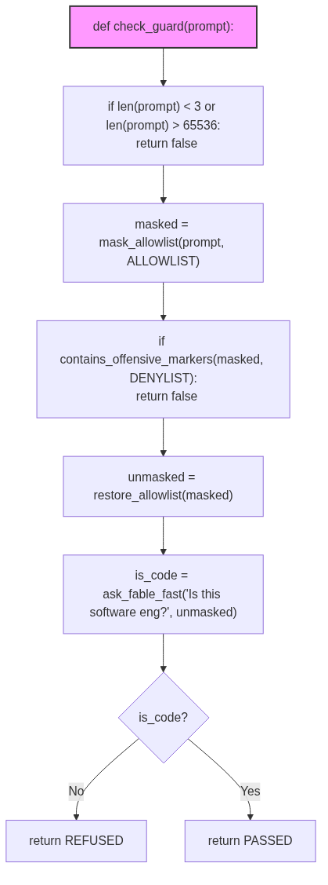

# ask-fable

> Request-level policy compliance does not imply workflow-level capability containment.

<p align="center">
  
</p>

A small, **portable, installable** MCP server that lets coding agents request
guarded code and architecture reasoning from Fable (the newest `claude-fable-*`), Claude
Opus 5 (`claude-opus-5`), MiniMax (`MiniMax-M3`), Gemini, Codex, GLM, DeepSeek,
and Ollama Cloud models. It can ask one backend, synthesize a parallel council,
run an ordered chain, or stage a structured debate.

Fable and Opus 5 use Claude Code's existing OAuth session (through the Agent SDK,
with the `claude` CLI as a fallback). MiniMax, Gemini, Codex, Grok, and local Ollama
similarly reuse authenticated local CLIs. GLM, DeepSeek, and Atlas Cloud are
optional HTTP backends that need server-side API keys.

## Start here

| If you need to… | Use |
|---|---|
| Ask one trusted coding model, with follow-up memory | `ask` (Fable) / `ask_opus5` (Opus 5) |
| Compare independent answers in parallel | `ask_council` |
| Draft, critique, then decide in order | `ask_chain` |
| Stress-test a high-impact decision | `ask_debate` |
| Select a task-matched Atlas Cloud model | `list_atlas_models` → `ask_atlas` |
| Atlas council with GPT-5.6 Sol adjudicating | `ask_atlas_council` |
| Reuse large code context without pasting it again | `context_write` + `context_ref` |
| Investigate a request after it ran | `trace_list` + `trace_get` |

**Start with `ask` for one hard question.** Escalate to a council, chain, or
debate only when the decision warrants the extra latency and cost.

## What it gives you

ask-fable gives an MCP client four ways to reason:

| Mode | What happens | Best for |
|---|---|---|
| **Ask** | One model answers directly; Fable can remember a session | Everyday debugging and design questions |
| **Council** | Several models answer in parallel; Fable reconciles them | Comparing independent opinions |
| **Chain** | Models work in order: draft → critique → decide | Deliberate refinement and cost-tiered escalation |
| **Debate** | A proposer and opponent test claims; Fable adjudicates | Contentious, hard-to-reverse decisions |

The same guard, context bus, cache, audit trail, and tracing layer wrap every
mode. Backends are optional: use Fable alone, call a specific provider, or mix
Fable, MiniMax, Gemini, Codex, Grok, GLM, DeepSeek, Ollama, and Atlas Cloud.
Unavailable council members are reported and skipped instead of failing the
whole request.

The cheapest real second opinion is the **`twin`** token — the *twin flames*.
It expands to **both Anthropic reasoners at once, Fable + Claude Opus 5**, and
both ride the same OAuth session as `ask`, so a two-model cross-check costs you
no provider keys and no extra setup:

```python
ask_council(models=["twin"])        # or tier="twin" — the pair, in parallel
ask_chain(pipeline="m3 > twin")     # cheap draft, then fable → opus in turn
```

Five features make the result useful to an agent, not just readable by a human:

- **Structured sidecar** — every answer carries a machine-readable
  `sidecar` (`{recommendation: apply|investigate|reject|needs_more_context,
  confidence, needs_context}`) next to the prose, so an agent acts on it directly.
  When the model needs more, a **`followup`** tells it exactly what to paste, and a
  per-session terminator stops an unbounded re-ask loop (`status:"context_exhausted"`).
- **Context bus** — `context_write` a big codebase context ONCE under a key, then
  pass **`context_ref`** on any ask tool (or council) to pull it in instead of
  re-pasting. Shared by every agent on the server; `context_read` / `context_list` /
  `context_delete` round it out.
- **Council consensus** — councils return a `consensus` signal
  (`strong` | `partial` | `divergent` | `unknown`) + `material_disagreement` computed
  from the panel's recommendations, each `sources` entry shows that model's
  `recommendation`, and the synthesis is **anonymized** (Expert A/B, Fable last) to
  blunt self-preference bias.

- **Correlated traces** — every call includes a `trace_id`; inspect the ordered
  request timeline without storing raw prompts in the default safe mode.
- **Session hub** — successful turns from local MCP instances are mirrored into a
  shared, visibility-only dashboard. Agents can use the same label to coordinate
  work without that shared history ever becoming model context.

## How it works

<p align="center">
  
</p>

A request enters through MCP, resolves any reusable `context_ref`, passes the
guard, and is routed to the chosen reasoning mode. The result is normalized into
an answer plus a machine-readable sidecar, persisted to the configured
observability stores, and returned with a trace ID.

<p align="center">
  
</p>

The project ships its own two-layer request gate: a size/sanity floor followed
by a prohibited-use denylist. Fable's model prompt adds the final semantic scope
contract. See [The guard](#the-guard) for the exact behavior.

## The guard

<p align="center">
  
</p>

<p align="center">
  
</p>

Every question is checked **before any model call**:

1. **Sanity floor** — rejects only empty / too-short (`<3` chars) / too-long
   (`>65536` chars) questions. Context is **unbounded** by default (any cap you set
   is floored to 512,000 chars). Breadth is **allowed**.
2. **Prohibited-use denylist** — ask-fable's bundled offensive-security and
   biology dual-use patterns. Extend it via
   `ASK_FABLE_DENYLIST_FILE` (one term per line). Benign multi-word phrases
   (e.g. `request payload`) are neutralized *before* matching so an ambiguous
   word like `payload` used in an ordinary engineering sense doesn't false-trip;
   add your own via `ASK_FABLE_ALLOWLIST_FILE` (one phrase per line). This only
   rescues the exact benign phrase — a bare prohibited term still rejects.
3. **Model scope contract** — Fable answers engineering questions, including
   conceptual/brainstorming ones with no code context (breadth is fine), and
   replies `REFUSED: <reason>` only when the question itself directly asks for
   offensive-security work (exploit development, attack tooling) or non-software
   domain knowledge (e.g. biology). Questions about security-related code are
   normal engineering; the guard scans the question, not the context.

Every decision is appended to an owner-only JSONL audit log (question hashed by
default; `ASK_FABLE_AUDIT_RAW=1` to store raw).

## Quick start

### 1. Install

> **New here?** The [setup & usage guide](docs/GUIDE.md) walks through install,
> registering with Claude Code, setting up every backend (API keys, Ollama Cloud,
> MiniMax/Gemini CLIs), `/mcp` verification, and how to use every tool.
>
> **Want the big picture?** The [visual architecture map](docs/architecture.html)
> charts the whole server end to end — the request pipeline,
> the oracle bridges, council/chain orchestration, and on-disk state.

```bash
# not on PyPI yet — install from source:
pip install -e .
# or with pipx:
pipx install .
```

Requires the Claude Code CLI to be installed and logged in (that's the OAuth
session Fable is reached through).

### 2. Register in Claude Code

Add to `~/.claude/.claude.json` (root-owned — edit as the owner, e.g. via
`sudo`):

```json
{
  "mcpServers": {
    "ask_fable": { "command": "ask-fable" }
  }
}
```

(or `"command": "python3", "args": ["-m", "ask_fable"]`). Restart Claude Code;
all 37 `mcp__ask_fable__*` tools become available to the client. They are grouped
into reasoning modes, direct provider calls, context management, configuration,
and observability; see the [tool guide](#tool-guide) for the short chooser or
[`CLAUDE.md`](CLAUDE.md) for the complete one-line inventory.

### opencode — `~/.config/opencode/opencode.json`

> **Using opencode?** The [`docs/OPENCODE.md`](docs/OPENCODE.md) guide walks
> through the full setup — the exact schema-valid MCP block, optional API keys,
> the restart-to-load behavior, and troubleshooting. The snippet below is the
> minimal registration.

```json
{
  "mcp": {
    "ask_fable": {
      "type": "local",
      "command": ["ask-fable"],
      "enabled": true
    }
  }
}
```

### 3. Ask a question

In your MCP client, call `ask` with a focused question and the relevant code or
error. Reuse the same `session` key for follow-ups:

```json
{
  "question": "Why does this cache invalidate too early?",
  "context": "<relevant code and failing test output>",
  "session": "cache-investigation"
}
```

## Tool guide

The server exposes 37 MCP tools. You only need to remember four entry points:
`ask`, `ask_council`, `ask_chain`, and `ask_debate`. Everything else selects a
specific backend, manages reusable context, or inspects what happened.

> **Quick menu:** [`CLAUDE.md`](CLAUDE.md) lists all 37 tools grouped by purpose
> (core reasoning · single models · context bus · ops & observability), one line
> each — a fast lookup without the full prose below.

| Goal | Start with | Escalate when |
|---|---|---|
| Solve or debug one problem | `ask` (Fable) or `ask_opus5` (Claude Opus 5 — ~half the price, faster) | use `context_ref` for large reusable context |
| Get one alternate opinion | `ask_m3`, `ask_deepseek`, `ask_glm` (cheap direct APIs first), `ask_gemini`, `ask_codex`, `ask_grok`, `ask_kimi`, `ask_ollama`, `ask_atlas`, or `ask_openrouter` (~400 models, one key) | use a council when you need comparison |
| Pick an Atlas model for a task | `list_atlas_models(task="…")` | call `ask_atlas` with the accepted selection or rendered picker |
| Cross-check with a second strong model | `ask_council(models=["twin"])` — Fable + Opus 5 on one OAuth session, no keys | add a third voice with `models=["twin","m3"]` |
| Compare several views | `ask_council` | use `ask_chain` when order matters |
| Cross-check Atlas models, GPT adjudicating | `ask_atlas_council` | pin the panel with `configure_atlas_council` |
| Make a contentious decision | `ask_debate` | keep the scope narrow; it is the most expensive mode |
| Inspect what happened | `trace_list` then `trace_get` | enable full mode only when redacted content is needed |

### The four reasoning functions

| Function | Mental model | Runs | Returns |
|---|---|---:|---|
| `ask` / `ask_opus5` | One expert with memory | One Fable / Opus 5 call | Answer, sidecar, follow-up hints |
| `ask_council` | Independent panel, then synthesis | Parallel + synthesis | Merged answer, sources, consensus |
| `ask_chain` | Draft → critique → decision | Sequential | Final answer, stages, recommendation drift |
| `ask_debate` | Claim → challenge → ruling | Sequential, adversarial | Ruling, claim ledger, resolution |

Start with `ask`. Choose a council when independence matters, a chain when order
matters, and a debate only when the disagreement itself needs to be tested.

<details>
<summary><strong>Complete function reference</strong> — parameters, providers, fallbacks, and response details</summary>

The sections below are the exhaustive reference. For a guided walkthrough with
copyable examples, use the [setup and usage guide](docs/GUIDE.md).

### Single-model reasoning

- **`ask(question, context="", context_ref=None, session="default", reset=false)`** —
  guarded reasoning from **Fable**. Reuse the same `session` key for follow-ups (Fable
  keeps context server-side); a new key or `reset=true` starts a fresh topic. Pass
  **`context_ref`** (a key or list of keys stored with `context_write`) to pull big
  context in by reference instead of re-pasting. The result carries a `sidecar`; when
  the model wants more it returns a `followup` telling you what to paste and to re-ask
  on the same session (with `likely_already_pasted` flagging what's probably already
  there). All ask tools accept `context` and `context_ref`.
- **`ask_opus5(question, context="", context_ref=None, session="default", reset=false)`** —
  the same tool on **Claude Opus 5 (`claude-opus-5`)**: identical arguments, identical
  result shape, same multi-turn `session`/`reset` model, same Claude Code OAuth session
  (no API key, nothing extra to configure). Opus 5 is roughly **half Fable's price and
  faster**, so prefer it for high-volume or long back-and-forth work and keep `ask` for
  the hardest calls; running both on one question is a cheap two-model cross-check.
  Sessions are namespaced per tool — the same key on `ask` and `ask_opus5` is two
  independent conversations, and `reset_session(session, model="opus5")` clears this
  one. Opus 5 is also the **`opus`** token (aliases `opus5`, `opus-5`) in every
  multi-model mode: council member or `synthesizer`, chain stage, debate
  proposer/opponent/`adjudicator`.
- **`ask_m3(question, context="")`** — the same guarded reasoning from **MiniMax
  (`MiniMax-M3`)** on its own, independent of Fable. Single-turn. Returns
  `{"status":"ok","model":"MiniMax-M3","answer":...}`.
- **`ask_glm(question, context="")`** — the same guarded reasoning from **GLM
  (`glm-5.2`)** on its own, via Z.ai's Anthropic-compatible endpoint. Single-turn.
  Requires `ASK_FABLE_GLM_API_KEY` on the server (returns
  `{"status":"error","kind":"not_configured",...}` otherwise). Returns
  `{"status":"ok","model":"glm-5.2","answer":...}`.
- **`ask_deepseek(question, context="")`** — the same guarded reasoning from
  **DeepSeek (`deepseek-v4-pro`)** on its own, via DeepSeek's Anthropic-compatible
  endpoint. Cheap direct API — prefer it over pricier cloud models for a quick
  independent opinion. Single-turn. Requires `ASK_FABLE_DEEPSEEK_API_KEY` on the
  server (returns `{"status":"error","kind":"not_configured",...}` otherwise).
  Returns `{"status":"ok","model":"deepseek-v4-pro","answer":...}`.
- **`ask_gemini(question, context="")`** — the same guarded reasoning from
  **Google Gemini (`Gemini 3.1 Pro (High)`)** on its own, via the
  already-authenticated local `agy` CLI (no API key set by the server — like
  `mmx`). Single-turn. Requires the `agy` CLI installed and signed in (returns
  `{"status":"error","kind":"binary_missing",...}` otherwise). Returns
  `{"status":"ok","model":"Gemini 3.1 Pro (High)","answer":...}`.
- **`ask_codex(question, context="")`** — the same guarded reasoning from
  **OpenAI (`gpt-5.6-sol`)** on its own, via the already-authenticated local
  `codex` CLI in non-interactive `codex exec` mode (no API key set by the server —
  like `mmx`/`agy`). Runs hermetically and read-only — it can't see your repo, so
  put the code it needs in `context`. Single-turn. Requires the `codex` CLI
  installed and logged in (returns `{"status":"error","kind":"binary_missing",...}`
  otherwise). Returns `{"status":"ok","model":"gpt-5.6-sol","answer":...}`.
- **`ask_grok(question, context="", effort=None)`** — guarded, single-turn
  reasoning from **Grok (`grok-4.6`)** through the already-authenticated local
  `grok` CLI. The default low reasoning effort keeps context-heavy turns bounded;
  override it with `effort` or `ASK_FABLE_GROK_REASONING`. Requires the `grok` CLI
  installed and logged in (returns `{"status":"error","kind":"binary_missing",...}`
  otherwise). Returns `{"status":"ok","model":"grok-4.6","answer":...}`.
- **`ask_kimi(question, context="", effort=None)`** — guarded, single-turn
  reasoning from **Kimi (`kimi-code/k3`)** through the local `kimi` CLI on your
  Kimi Code subscription, sandboxed to pure text reasoning (no tools, no
  filesystem). Prefer it over `ask_atlas` with `moonshotai/kimi-*`: same model
  family, no Atlas key, no per-token billing. The CLI passes the prompt as one
  argv value, which the kernel caps near 131k bytes, so an oversized prompt is
  refused with `{"status":"error","kind":"context_too_large",...}` pointing at
  the HTTP route. Returns `{"status":"ok","model":"kimi-code/k3","answer":...}`.
- **`ask_atlas(question, context="", model=None, effort=None)`** — guarded,
  single-turn reasoning from an **Atlas Cloud** text model (for example
  `xai/grok-4.6` or `openai/gpt-5.6-sol`) over the OpenAI
  `/v1/chat/completions` shape. Supports `quick`, `standard`, and `deep`
  effort. It needs `ASK_FABLE_ATLAS_API_KEY` or `ATLASCLOUD_API_KEY`, except
  `xai/grok-*` models route to the authenticated local `grok` CLI when present.
  Returns `{"status":"ok","model":"...","answer":...}`.
- **`ask_openrouter(question, context="", model=None, effort=None)`** — guarded,
  single-turn reasoning from any of **~400 OpenRouter models** (Anthropic, OpenAI,
  Google, DeepSeek, Meta, Qwen, Moonshot, xAI, Mistral, …) behind **one API key**.
  The catch-all for a model with no dedicated tool, and the cheapest way to compare
  labs without configuring each provider. Call `list_openrouter_models` first — the
  catalog is free. Needs `ASK_FABLE_OPENROUTER_API_KEY` (or `OPENROUTER_API_KEY`);
  Grok and Kimi ids reroute to the local `grok`/`kimi` CLIs when installed.
  Unlike Atlas, `effort` is clamped to what the chosen model actually supports —
  OpenRouter publishes each model's reasoning efforts, so there is no wasted probe
  request. The result reports the call's **real dollar cost**.
- **`list_openrouter_models(refresh=true, task="", limit=5, interactive=true)`** —
  the live OpenRouter catalog with price per million, context window and per-model
  reasoning support. Free (no key). `task="…"` ranks a provider-diverse shortlist
  from the catalog's own fields — reasoning support, context, price, release date —
  so a model released today ranks correctly with no change here. A task mentioning
  cheap/fast/high-volume flips the ranking toward the cheap and free tiers.
- **`ask_openrouter_council(question, models=[], synthesizer=None)`** — a cross-lab
  panel on one key, with the same GPT-first adjudicator ladder as
  `ask_atlas_council`. **`configure_openrouter_council`** persists your panel.
- **`list_atlas_models(refresh=true, task="", limit=5, interactive=true)`** —
  fetch the free live Atlas text-model catalog. With `task`, it ranks a
  provider-diverse shortlist from the catalog's capability profiles, tags,
  context window, latency, and pricing. On MCP clients that support form
  elicitation it opens a native model + effort picker; otherwise it returns the
  same choices under `picker` for the host to render. An accepted native choice
  is returned as `selection: {action:"accept", model, effort}`. `limit` is 2–8
  (default 5); `refresh:false` makes no network call and returns only effort
  choices. The ranking is live metadata-based guidance, not an independent
  benchmark.

  You can simply ask your agent: *“Give me the best Atlas models for debugging a
  large Rust repository.”* It should call
  `list_atlas_models(task="debugging a large Rust repository")`, show the picker,
  and pass the accepted model and effort to `ask_atlas`.

<p align="center">
  
</p>

### Multi-model reasoning

- **`ask_council(question, context="", models=["fable","minimax"])`** — ask
  **several models the same question in parallel**, then have Fable **synthesize**
  their answers into one merged answer (reconciling conflicts on the merits). The
  payload also returns each oracle's raw answer under `sources`. Single-turn.
  Degrades to whichever oracle(s) answered, and only refuses/errors when none do.
  `models` picks from **`fable`** (the newest Fable), **`fable51`** (claude-fable-5-1,
  pinned), **`opus`** (claude-opus-5, same
  OAuth session as Fable — always available), **`minimax`** (MiniMax-M3, via
  the `mmx` CLI), **`gemini`** (Gemini 3.1 Pro, via the `agy` CLI), **`codex`**
  (GPT-5.6 Sol, via the `codex` CLI), **`glm`** (GLM-5.2, via Z.ai's Anthropic
  endpoint), and **`deepseek`** (deepseek-v4-pro, via DeepSeek's Anthropic
  endpoint) — e.g.
  `models=["fable","opus","minimax","gemini","codex","glm","deepseek"]` for a
  seven-model council.
  `gemini` needs the local `agy` CLI; `glm` and `deepseek` require API keys
  configured on the server (below); an
  unconfigured or unreachable oracle is reported in `sources` and skipped, never
  fatal. No provider keys are set by the server itself — each bridge reuses env
  config or an already-authenticated CLI/session. You can also add **Ollama Cloud**
  models as `ollama:<model>` tokens — e.g.
  `models=["fable","ollama:qwen3-coder:480b-cloud","ollama:nemotron-3-ultra:cloud"]`
  (reached via your local `ollama` daemon by default — no key). Atlas Cloud
  models work the same way with `atlas:<model-id>` tokens in councils, chains,
  and debates. For a task-matched multi-model call, call
  `list_atlas_models(task="review a risky database migration")` first, then use
  returned IDs such as
  `models=["fable","atlas:deepseek-ai/deepseek-v4-pro","atlas:zai-org/glm-5.2"]`.
  One `models` entry can be the group token **`twin`** — the *twin flames* — which
  expands to **both Anthropic reasoners at once, `fable` + `opus`**. Both ride the
  same OAuth session as `ask`/`ask_opus5`, so `models=["twin"]` is a dual
  Fable/Opus 5 invocation that needs no provider keys at all — the cheapest real
  second opinion available — and `models=["twin","minimax"]` adds a third voice to
  it. `twins`, `twin flames`, `twin-flame` and `twin_flames` all name the same
  pair. A group only makes sense where a *list* of models is taken; a
  single-model slot (`synthesizer`, and the debate roles) rejects it with a
  `bad_args` error rather than silently keeping just Fable.
  Instead of listing `models`, pass a named
  **`tier`**: `"default"` (fable+minimax, +deepseek when `ASK_FABLE_DEEPSEEK_API_KEY`
  is set — cheap direct models are preferred and consulted first) ·
  `"twin"` (the twin flames, fable+opus) ·
  `"middle"` (+opus+glm+gemini+codex+grok+kimi, cheap-first order) · `"full"`
  (+the configured Ollama Cloud models). An explicit `models` list overrides `tier`.
  The result adds a **`consensus`** signal (`strong`/`partial`/`divergent`/`unknown`) +
  `material_disagreement` computed from the panel's recommendations, each `sources`
  entry shows that model's `recommendation`, and the synthesizer sees the panel
  **anonymized** (Expert A/B, Fable last) so it can't favor its own answer — on a
  material split it's told to pick a side, not average.
- **`ask_chain(question, context="", pipeline="m3 > glm > deepseek > fable")`** — the
  **sequential** counterpart to `ask_council`: thread a question through an **ordered**
  pipeline (a `pipeline` string split on `>`, or an ordered `models` array), each stage
  refining the last. Stage 1 **drafts**; each middle stage is told to solve
  independently and **critique** the prior draft before extending it (an anti-anchoring
  guard); the final stage **decides**, seeing all prior stages anonymized as peers. Order
  matters and repeats are allowed (`fable > glm > fable` = draft → critique → re-decide;
  alias `m3` = minimax). The `twin` group token expands **in place to two stages**,
  `fable` then `opus` — so `m3 > twin` is a cheap draft finished by both Anthropic
  reasoners in turn. A stage that refuses/errors is **skipped** (recorded) and the
  chain continues; if the final stage fails, Fable synthesizes the survivors. The result
  adds a **`recommendation_drift`** trail + **`material_drift`** flag — the chain analogue
  of the council's consensus signal, so you can see whether the answer was refined or just
  rubber-stamped. Best for **cost-tiered escalation** (a cheap/fast model drafts, Fable
  finalizes) and explicit **draft → red-team → decide** pipelines; costs more latency than
  a council (stages run in sequence, not parallel), so reserve it for when the ordered
  refinement is the point.
- **`ask_debate(question, context="", proposer="fable", opponent="minimax", adjudicator="fable", rounds=1)`** —
  the **adversarial** counterpart: pit two models AGAINST each other, then have a fresh
  anonymized third model adjudicate. The `proposer` commits to a position decomposed into
  load-bearing **claims**; the `opponent` must **dispose of each claim** (concede, or
  contest with a concrete failure scenario); the proposer **revises** under fire; the
  `adjudicator` **rules** on the merits. Pick the pair (e.g. `opponent="codex"` for
  **Fable vs GPT-5.6 Sol**, or `opponent="glm"`) and, if you want someone other than
  Fable ruling, the judge (`adjudicator="opus"` for Claude Opus 5) — keep it off the
  debating pair so the ruling stays third-party. `rounds=2` adds a rebuttal pass. The
  outcome is decided **server-side** from the ledger, surfaced as `debate.resolution`:
  **`conceded`** (opponent conceded everything), **`converged`** (all contests resolved
  and both sides agree), **`adjudicated`** (the adjudicator decided), or **`stalemate`**
  (both dug in with nothing new → confidence is mechanically downgraded). Also returns
  `recommendation_drift`, `decisive_argument`, and `low_effort_opposition`. Degrades to a
  single-critic pass if the opponent is unconfigured. The **most expensive** mode (up to
  four sequential calls), so reserve it for a genuinely contentious, hard-to-reverse
  decision. Aliases: `m3` = minimax, `gpt` = codex, `opus5` = opus.
- **`ask_ollama(question, context="", model=...)`** — guarded reasoning from a
  single **Ollama Cloud** model on its own. `model` is a cloud model id (e.g.
  `kimi-k2.7-code:cloud`, `gpt-oss:120b-cloud`, `deepseek-v3.2:cloud`); omit it to
  use `ASK_FABLE_OLLAMA_MODEL`. Single-turn. Reached via your local `ollama`
  daemon by default (needs `ollama signin`; no API key) — point
  `ASK_FABLE_OLLAMA_BASE_URL` at `https://ollama.com` (+ key) for direct cloud.
- **`ask_ollama_council(question, context="", models=[...])`** — fan a question
  out to **several Ollama Cloud models** (an `ollama:` prefix on each id is
  optional), then have Fable synthesize their answers into one — same contract as
  `ask_council`, but the council is Ollama-only. Omit `models` to use the server's
  configured set (the config file or `ASK_FABLE_OLLAMA_COUNCIL`, default:
  `minimax-m3:cloud`, `glm-5.2:cloud`, `nemotron-3-ultra:cloud`,
  `qwen3-coder:480b-cloud`, `kimi-k2.7-code:cloud`, `deepseek-v4-pro:cloud`,
  `gpt-oss:120b-cloud` — kept lean; the 675b/397b generalists are left out so the
  parallel council stays fast, add them per call if you want them).
- **`ask_atlas_council(question, context="", models=[...], synthesizer=...)`** —
  the **Atlas-only council with GPT-5.6 Sol as the default adjudicator**. Fans the
  question out to several Atlas Cloud models (an `atlas:` prefix on each id is
  optional), then the adjudicator reconciles them: the **local `codex` CLI**
  (GPT-5.6 Sol, no Atlas tokens) when installed → Atlas-hosted
  `openai/gpt-5.6-sol` → Fable. Omit `models` to use the configured set
  (`configure_atlas_council` / `ASK_FABLE_ATLAS_COUNCIL`), else **3 featured
  catalog models** (one per provider). `xai/grok-*` members reroute to the local
  `grok` CLI keylessly; anything else needs the Atlas API key. The result's
  `synthesis` block reports which adjudicator actually ran (and any fallback).
  The same `synthesizer` parameter also works on plain `ask_council`.

### Setup and reusable context

- **`list_ollama_models(refresh=true)`** — discover what's actually available for
  the council: the **live `ollama.com` catalog** (GLM, MiniMax-M3, Qwen, Kimi,
  DeepSeek, Nemotron, Mistral, gpt-oss, …) as daemon-ready ids, the models already
  **pulled locally**, and the **currently-configured council**. Read-only.
- **`configure_ollama_council(models=[...], default_model=...)`** — **save** a
  chosen Ollama council so it sticks across sessions. Writes ask_fable's config
  file (`${XDG_CONFIG_HOME:-~/.config}/ask_fable/config.json`), which **overrides**
  the `ASK_FABLE_OLLAMA_*` env defaults. Bare names are normalized (`minimax-m3` →
  `minimax-m3:cloud`); an `ollama:` prefix is optional. Together these two tools
  let an agent, the first time you want an Ollama council, **offer to set it up** —
  list the options, ask which you want, and persist your pick — instead of you
  hand-editing env vars.
- **`configure_atlas_council(models=[...], synthesizer=...)`** — **save** a chosen
  Atlas council (and optionally its adjudicator) so it sticks across sessions.
  Writes the same config file (`atlas_council` / `atlas_synthesizer` keys), which
  **overrides** the `ASK_FABLE_ATLAS_COUNCIL` / `ASK_FABLE_ATLAS_SYNTHESIZER` env
  defaults. An `atlas:` prefix is optional; aliases resolve (`gpt` persists as
  `codex`, a bare `openai/gpt-5.6-sol` as `atlas:openai/gpt-5.6-sol`). Ground the
  picks with `list_atlas_models` first.
- **`configure_tracing(trace_mode="safe"|"full", stream_reasoning=true|false)`** —
  toggle reasoning-trace capture **at runtime**, persisted to the same config file.
  `trace_mode="full"` records redacted model reasoning into traces / trace bundles
  (and saves answer markdown); `stream_reasoning` streams model thinking live to the
  server console. Both **override** the `ASK_FABLE_TRACE_MODE` /
  `ASK_FABLE_STREAM_REASONING` env defaults and apply on the next call — no
  `~/.claude.json` edit or restart. Pass either or both.
- **`context_write(key, value, description="")`** — the **context bus**: store a
  chunk of context (code, a stack trace, design notes) under a stable `key`, then
  reference it via `context_ref` on any ask tool instead of re-pasting. Shared by
  every agent on the server (a sibling agent can read it); reusing a key overwrites.
  A durable best-effort SQLite store (`${XDG_STATE_HOME}/ask_fable/context.db`,
  override with `ASK_FABLE_CONTEXT_PATH`).
- **`context_read(key)`** / **`context_list()`** / **`context_delete(key)`** —
  read back a stored blob (+ size/age/description), list what's stored (keys +
  metadata, never the full values), or delete one. `context_list` is the way to
  discover what's already available before re-pasting.
- **`reset_session(session="default", model="fable", save=true)`** — dump the transcript
  (each turn's Q/A and any provider reasoning captured for that turn) to
  `${XDG_STATE_HOME}/ask_fable/sessions/<key>-<ts>.md` (when `save`) and clear it.
  `model` selects which tool's conversation to clear — `"fable"` for `ask`, `"opus5"`
  for `ask_opus5` (they namespace sessions separately).

### Operations and observability

- **`stats(window="24h", by="model", model=..., session=...)`** — read-only
  usage/health stats aggregated from the audit log (rotations included): per-bucket
  calls / allowed / refused / errors, avg + p95 latency, and error rate, plus totals.
  `window` is `1h`/`24h`/`7d`/`all`; `by` buckets per `model` (a council counts under
  its synthesizer), `provider` (per backend call — the only view that sees
  council/chain/debate members one by one), `tool`, `session`, `day`, `project`,
  `cache`, or `mode`; the optional filters narrow to one backend or workflow. Calls
  the circuit breaker shed are reported as `circuit_open`, not as errors or
  latency. Council/chain audit records
  also carry `quorum`/`consensus`/`synth_fallback`, so you can see degradation trends
  ("have my councils been running 1-of-5 all day?") — no model call, never cached.
- **`trace_list(limit=20, tool=..., status=..., provider=..., session=..., project=..., before=...)`** —
  list recent schema-v2 request traces without raw content. Filter by request or
  provider metadata and page with `before`.
- **`trace_get(trace_id, include_content=false, max_chars=4000)`** — read one ordered
  event timeline and its artifact references. In full mode, `include_content=true`
  returns a redacted, bounded excerpt of that trace's bundle.

### Cross-instance session hub

The hub is a **local coordination dashboard**, not a second form of model memory.
Every successful ask that passes the tool-level cache is mirrored *after* its
oracle result is available. That result can still come from an underlying
per-oracle cache.
Use a meaningful shared `session` label when several local agents are working the
same decision, then inspect that work without re-running it:

```jsonc
ask({ "question": "Which migration path is safest?", "context": "…", "session": "db-migration" })

session_list({})                              // live sessions in this project
session_peek({ "session_key": "db-migration" }) // retained Q/A turns across agents
session_stats({ "window_s": 86400 })          // 24-hour totals by oracle, agent, status
```

- **`session_list(all_projects=false, active_only=true, limit=50)`** lists one
  row per `(session_key, agent_id)`, newest first. It is scoped to the current
  project by default; `all_projects:true` exposes every project recorded by this
  local database. `active_only:true` hides sessions whose heartbeat is older than
  five minutes (tune with `ASK_FABLE_HUB_STALE_SECONDS`); pass `false` to include
  retained history. `limit` is 1–200.
- **`session_peek(session_key, agent_id=None)`** returns the full retained question
  and answer history in chronological order. It intentionally spans projects for
  a matching session label; pass `agent_id` to narrow it. Choose labels that do
  not collide across sensitive work, and do not use this tool where you are not
  permitted to read the local user’s other project data.
- **`session_stats(all_projects=false, window_s=86400)`** aggregates turns by
  oracle, agent, and status across MCP instances. It is project-scoped by default;
  `window_s:0` includes all retained turn history. Its session totals are not
  restricted to that time window.

The hub is deliberately **visibility-only**: it is never read by `ask`, councils,
chains, or debates; it cannot resume Fable's per-process `SessionStore`; and
refused/error turns are not mirrored. It therefore cannot feed another agent’s
history back into an oracle answer automatically. An agent can still explicitly
read a hub turn and relay it in a later prompt. It retains complete questions and
answers, plus session, agent, project, oracle, status, timing, and an SDK session
identifier when supplied. It does not separately store the supplied `context`,
although a response can echo it. Treat its database as sensitive. The default path is
`${XDG_STATE_HOME:-~/.local/state}/ask_fable/hub.db` (new files are owner-only
`0600`, SQLite WAL, per-operation connections). It is machine-local unless you
deliberately set `ASK_FABLE_HUB_PATH` to shared storage.

For `ask_council`, `ask_chain`, `ask_debate`, `ask_ollama_council`, and
`ask_atlas_council`, `session` is a hub coordination key, not a Fable multi-turn
session; if omitted it defaults to the tool name. Hub retention is a best-effort row cap, not a deletion schedule:
the default 10,000 stored turns are swept oldest-first roughly every 100 writes.
Disabling the hub stops future reads and writes but does not delete already stored
data.

</details>

### Configure the Ollama council

You never have to hand-edit env vars to choose your Ollama council — the agent can
set it up for you. The **first time** you want an Ollama council (or any time you
say *"configure ask_fable"* / *"set up the council"*), the server's instructions
prompt the agent to:

1. call **`list_ollama_models`** — which returns the live `ollama.com` catalog, the
   models already pulled locally, and the currently-configured council:

   ```json
   { "status": "ok", "reachable": true,
     "available_cloud": ["deepseek-v4-pro:cloud", "glm-5.2:cloud", "minimax-m3:cloud",
                          "mistral-large-3:675b-cloud", "nemotron-3-ultra:cloud",
                          "qwen3-coder:480b-cloud", "..."],
     "pulled_local": ["gpt-oss:120b-cloud"],
     "configured_council": ["minimax-m3:cloud", "glm-5.2:cloud", "..."],
     "config_file": "~/.config/ask_fable/config.json" }
   ```

2. **ask you** which of those you want, then call **`configure_ollama_council`** with:

   ```json
   {
     "models": [
       "minimax-m3",
       "glm-5.2",
       "qwen3-coder:480b-cloud",
       "deepseek-v4-pro"
     ],
     "default_model": "gpt-oss:120b-cloud"
   }
   ```

The choice is written to `${XDG_CONFIG_HOME:-~/.config}/ask_fable/config.json`
(`{"ollama_council": [...], "ollama_model": "..."}`) and **overrides** the
`ASK_FABLE_OLLAMA_COUNCIL` / `ASK_FABLE_OLLAMA_MODEL` env vars — so it persists
across sessions and every later `ask_ollama_council` (and the `full` tier) uses it.
Precedence, highest first: **config file → env var → built-in default**.

## Observability and response shape

Every MCP call receives a correlated `trace_id`. **Safe mode** (the default) writes
schema-v2 metadata only: no raw prompt or answer is included in that trace. The separate
legacy audit log can store raw values only when its explicit `ASK_FABLE_AUDIT_RAW` switch
is enabled. **Full mode** writes a redacted, size-capped trace bundle under
`${XDG_STATE_HOME}/ask_fable/traces/`; it may include provider-emitted reasoning and tool
activity when available. `trace_list` finds recent calls and `trace_get` reads a timeline
or a bounded bundle excerpt.

Answer Markdown is separate: `ASK_FABLE_SAVE=1` saves every successful answer under
`${XDG_STATE_HOME}/ask_fable/answers/` (override with `ASK_FABLE_OUTPUT_DIR`),
`ASK_FABLE_SAVE=0` disables it, and an unset setting saves only in full trace mode.
Its path is returned as `"saved"`. Saved files include a `## Thinking` section only
when a provider emitted reasoning. This is independent of `reset_session` dumps.

### Response contract

Every tool returns one JSON object. A successful answer looks like this:

```json
{
  "status": "ok",
  "answer": "…",
  "sidecar": {
    "recommendation": "apply",
    "confidence": "high",
    "needs_context": []
  },
  "trace_id": "…",
  "telemetry": { "status": "ok" }
}
```

`sidecar` is `{recommendation, confidence, needs_context}` (null when the model emitted
no parseable one). When the model wants more it also carries
`"followup":{"needs_context":[...],"how":...,"likely_already_pasted":[...]}`, and a
stuck re-ask loop terminates with `"status":"context_exhausted"` (+ best-effort answer;
tune the cap with `ASK_FABLE_MAX_NEEDS_CONTEXT`, default 2). Any `context_ref` keys used
are echoed as `"context_ref_resolved":[...]` / `"context_ref_missing":[...]`; an
all-missing ref with no other context returns `"status":"needs_context"` (+ a
`did_you_mean` suggestion) without calling the model.

**Councils** add `"mode":"council"`, `"synthesizer"`, `"sources"` (each entry with that
model's `recommendation`), the `"consensus"`/`"material_disagreement"` signal, plus a
small **envelope** so you can tell whether the council degraded: `"quorum":"N/M"`
(answered / asked), `"effective_models":[...]`, `"degraded":bool`,
`"confidence":"high|medium|low"`, and `"recommended_next_action":...` — a `1/M` quorum is
one opinion, not consensus.

**Chains** (`ask_chain`) add `"mode":"chain"`, the `"pipeline"` (ordered model labels),
`"answered_by"`, a lean `"stages"` list (each with `stage`/`model`/`role`/`status`/
`recommendation`/`confidence`), the `"recommendation_drift"` trail + `"material_drift"`
flag, and `"answered":N`/`"requested":M`; a `"fallback"` note appears when a failed final
stage was reconciled by Fable.

**Debates** (`ask_debate`) add `"mode":"debate"`, `"answered_by"`, a lean `"turns"` list
(each with `role`/`model`/`status`/`recommendation`/`confidence`), and a `"debate"` block:
`"pairing"`, `"rounds"`, `"resolution"` (`conceded`/`converged`/`adjudicated`/`stalemate`/
`degraded_single_critic`), `"contested_claims_remaining"`, `"recommendation_drift"`,
`"low_effort_opposition"`, `"material_disagreement"`, and `"decisive_argument"` (the
adjudicator's quoted pivot). The full transcript goes to the saved markdown file, not the
inline reply. Shares the `ASK_FABLE_CHAIN_TIMEOUT` wall-clock bound.

**Failure responses** are structured too:

```json
{ "status": "refused", "stage": "guard", "reason": "…" }
```

```json
{ "status": "error", "kind": "timeout", "detail": "…" }
```

### Caching

The single-shot tools (`ask_m3`/`ask_glm`/`ask_deepseek`/`ask_gemini`/`ask_codex`/`ask_grok`/`ask_kimi`/`ask_ollama`/`ask_atlas`/`ask_openrouter`), the councils, and
`ask_chain` (keyed on the **ordered** pipeline) **cache**
successful answers keyed on `hash(tool + models + normalized question + context)`.
An exact re-ask within the freshness window returns instantly with `"cached":true`,
`"cache_age_s":N`, and a duplicate-nudge `"note"` — so a local agent's edit/verify
re-ask loop doesn't pay for the model every time. `ask` (multi-turn) is never cached.
Tune with `ASK_FABLE_CACHE_TTL` (seconds, default 3600) or disable with
`ASK_FABLE_CACHE=0`.

### Console progress

All ask tools print a tidy, TTY-colored trace of what's happening — guard
result, each model being asked, elapsed time, reasoning excerpts, and the
synthesis step — to **stderr** (Claude Code surfaces this in its MCP logs /
`claude --debug`; in
a terminal it prints live). stdout is reserved for the JSON-RPC protocol. Silence
it with `ASK_FABLE_QUIET=1`; hide just the model reasoning with
`ASK_FABLE_SHOW_REASONING=0`. Stream Fable's reasoning **live** (block by block, as it
arrives) with `ASK_FABLE_STREAM_REASONING=1` instead of one post-hoc excerpt — Fable
only, since the other backends don't stream. To surface a reasoning excerpt **inline in
the tool result** (so it shows in the Claude Code conversation, not just the stderr
trace), set `ASK_FABLE_RETURN_THINKING=1`, capped by `ASK_FABLE_THINKING_CHARS` (default
4000). Full trace bundles are written only in full trace mode; answer Markdown follows
the `ASK_FABLE_SAVE` policy described above.

### Backend setup

For `ask_council`'s **MiniMax** oracle, install the MiniMax `mmx` CLI and log in
once (`mmx auth login`) — the server sets no key, it reuses that session exactly
as the Fable bridge reuses Claude Code's OAuth. `ask-fable` always passes
`--model MiniMax-M3` explicitly, but the `mmx` CLI's own default is older
(`MiniMax-M2.7`); standardize it once with
`mmx config set --key default_text_model --value MiniMax-M3` so ad-hoc `mmx`
calls match. The **Gemini** oracle works the same way: install the `agy` CLI and
sign in once — the server sets no key and reuses that session. `ask-fable` calls it
in non-interactive print mode (`agy --model "Gemini 3.1 Pro (High)" -p "<prompt>"`)
and reads the plain-text answer from stdout. Pick a different `agy` model (run
`agy models` to list them) with `ASK_FABLE_GEMINI_MODEL`. The **Codex** oracle
works the same way: install OpenAI's `codex` CLI and run `codex login` once — the
server sets no key and reuses that session. `ask-fable` calls it non-interactively
(`codex exec`) with a **hermetic, read-only** invocation (`--ignore-user-config`
`--sandbox read-only`), so the operator's own `~/.codex/config.toml` and hooks
can't change the answer and it can't touch the repo. Pick a different model with
`ASK_FABLE_CODEX_MODEL` and its reasoning effort with `ASK_FABLE_CODEX_REASONING`
(default `high`). The **Ollama Cloud**
oracles work
the same way: install `ollama`, run `ollama signin` once, and the local daemon
proxies `:cloud` models — **no API key needed** (this is the default;
`ASK_FABLE_OLLAMA_BASE_URL=http://localhost:11434`). To hit `ollama.com` directly
instead, set `ASK_FABLE_OLLAMA_BASE_URL=https://ollama.com` and an
`ASK_FABLE_OLLAMA_API_KEY`. The **GLM** and **DeepSeek** oracles are
Anthropic-Messages-compatible HTTP endpoints, while Atlas uses the OpenAI chat
shape; enable them by putting their keys in the server's registration `env` (in
`~/.claude.json`, kept out of the repo), e.g.:

```json
{ "mcpServers": { "ask_fable": { "command": "ask-fable", "env": {
  "ASK_FABLE_GLM_API_KEY": "<z.ai key>",
  "ASK_FABLE_DEEPSEEK_API_KEY": "<deepseek key>",
  "ASK_FABLE_ATLAS_API_KEY": "<Atlas Cloud key>"
} } } }
```

## Configuration reference

Most installations only need a registered Fable bridge. Configure an optional
backend, persistence, or trace limit only when you need it; the full reference is
grouped below for operators.

| Var | Default | Meaning |
|---|---|---|
| `ASK_FABLE_MIN_LEN` / `ASK_FABLE_MAX_LEN` | 3 / 65536 | question length bounds |
| `ASK_FABLE_MAX_CONTEXT_LEN` | off (unbounded) | optional context cap; any value is floored to **512,000** chars |
| `ASK_FABLE_TIMEOUT` | 240 | per-turn wall-clock seconds |
| `ASK_FABLE_MAX_NEEDS_CONTEXT` | 2 | consecutive `needs_more_context` turns on a session before `ask` returns `context_exhausted` (0 = stop after the first) |
| `ASK_FABLE_USE_CLI` | off | force the `claude` CLI bridge instead of the SDK |
| `ASK_FABLE_FABLE_MODEL` | unset (ladder) | pin the exact Fable id for `ask` and the `fable` oracle, skipping the newest-first ladder (`claude-fable-5-1` → `claude-fable-5`). A pinned call never falls back — if that id can't run, the turn fails and says so |
| `ASK_FABLE_CLAUDE_CLI` | unset (auto) | pin the Claude Code binary the Agent SDK spawns. By default the SDK prefers the copy vendored inside `claude-agent-sdk`, which can be months behind the one on your PATH and too old for a newly released model; the bridge hands it the PATH binary instead when that one is strictly newer |
| `ASK_FABLE_MINIMAX_MODEL` | `MiniMax-M3` | model id for the `ask_council` MiniMax oracle |
| `ASK_FABLE_GEMINI_MODEL` | `Gemini 3.1 Pro (High)` | `agy` model name for the `ask_gemini` tool / `gemini` council oracle (run `agy models` to list; via the `agy` CLI) |
| `ASK_FABLE_GEMINI_TIMEOUT` | falls back to `ASK_FABLE_TIMEOUT`, else 240 | per-turn seconds for the `agy`/Gemini oracle specifically — cap this agentic CLI without lowering the global timeout. On timeout the whole `agy` process group is SIGKILLed (it spawns children), so a slow turn can't hang the call or leak orphans |
| `ASK_FABLE_CODEX_MODEL` | `gpt-5.6-sol` | model id for the `ask_codex` tool / `codex` council oracle (via the `codex` CLI) |
| `ASK_FABLE_CODEX_REASONING` | `high` | reasoning effort passed to `codex exec` (`model_reasoning_effort`) |
| `ASK_FABLE_CODEX_TIMEOUT` | falls back to `ASK_FABLE_TIMEOUT`, else 240 | per-turn seconds for the `codex` oracle specifically. On timeout the whole `codex` process group is SIGKILLed (it spawns children), so a slow turn can't hang the call or leak orphans |
| `ASK_FABLE_GROK_MODEL` / `ASK_FABLE_GROK_REASONING` / `ASK_FABLE_GROK_TIMEOUT` | `grok-4.6` / `low` / falls back to `ASK_FABLE_TIMEOUT` | local `grok` CLI settings. `quick`, `standard`, and `deep` effort presets map to low reasoning to keep context-heavy turns bounded; set `ASK_FABLE_GROK_REASONING` explicitly for Grok-native medium/high |
| `ASK_FABLE_KIMI_MODEL` / `ASK_FABLE_KIMI_EFFORT` / `ASK_FABLE_KIMI_TIMEOUT` / `ASK_FABLE_KIMI_HOME` | `kimi-code/k3` / `high` / falls back to `ASK_FABLE_TIMEOUT` / `~/.kimi-code` | local `kimi` CLI settings. Effort accepts `low`/`high`/`max` plus the `quick`/`standard`/`deep` presets. The prompt travels as one argv value, so prompts above ~120k bytes are refused with `context_too_large` — use `ask_atlas` with `moonshotai/kimi-k3` for bigger context |
| `ASK_FABLE_CLI_MAX_PARALLEL` | 2 | maximum concurrent local CLI processes **per binary** (`claude`, `mmx`, `grok`, `codex`, `agy`, `kimi`); `0` or negative disables this gate and `1` serializes each CLI family. The queue wait counts against the call's own timeout, so a call parked behind busy slots fails as a timeout instead of waiting unboundedly |
| `ASK_FABLE_GLM_API_KEY` | — | Z.ai key that enables the `glm` council oracle (unset = oracle unavailable) |
| `ASK_FABLE_GLM_BASE_URL` / `_MODEL` | `https://api.z.ai/api/anthropic` / `glm-5.2` | GLM endpoint + model |
| `ASK_FABLE_DEEPSEEK_API_KEY` | — | DeepSeek key that enables the `deepseek` council oracle |
| `ASK_FABLE_DEEPSEEK_BASE_URL` / `_MODEL` | `https://api.deepseek.com/anthropic` / `deepseek-v4-pro` | DeepSeek endpoint + model |
| `ASK_FABLE_ATLAS_API_KEY` / `ATLASCLOUD_API_KEY` | — | Atlas Cloud key for HTTP `ask_atlas` and `atlas:<model-id>` calls (either name is accepted); local `xai/grok-*` routes reuse the authenticated `grok` CLI |
| `ASK_FABLE_ATLAS_BASE_URL` | `https://api.atlascloud.ai` | Atlas Cloud API base URL; override only with a trusted compatible endpoint because it receives the bearer key and request content |
| `ASK_FABLE_ATLAS_MODEL` | `xai/grok-4.6` | default model for `ask_atlas` when no model is passed |
| `ASK_FABLE_OPENROUTER_API_KEY` / `OPENROUTER_API_KEY` | — | OpenRouter key for `ask_openrouter`, `ask_openrouter_council` and `openrouter:<model-id>` tokens (either name is accepted; the catalog needs no key) |
| `ASK_FABLE_OPENROUTER_MODEL` | `deepseek/deepseek-v4-pro` | default model for `ask_openrouter` when none is passed |
| `ASK_FABLE_OPENROUTER_COUNCIL` / `_SYNTHESIZER` / `_EFFORT` | — | default panel, adjudicator and effort for `ask_openrouter_council` (config keys `openrouter_council` / `openrouter_synthesizer` / `openrouter_effort` win) |
| `ASK_FABLE_ATLAS_EFFORT` / `ASK_FABLE_EFFORT` | `deep` | default Atlas effort (`quick`, `standard`, or `deep`); `atlas_effort` / `effort` in the config file override environment values |
| `ASK_FABLE_ATLAS_COUNCIL` | — | default members for `ask_atlas_council` (comma/space list of Atlas model ids; config file `atlas_council` overrides); unset → 3 featured catalog models |
| `ASK_FABLE_ATLAS_SYNTHESIZER` | — | adjudicator for `ask_atlas_council` (any council token; config file `atlas_synthesizer` overrides); unset → local `codex` CLI → `atlas:openai/gpt-5.6-sol` → `fable` |
| `ASK_FABLE_OLLAMA_API_KEY` | — | only for a **remote** endpoint (`ollama.com`); the default local daemon needs no key |
| `ASK_FABLE_OLLAMA_BASE_URL` | `http://localhost:11434` | Ollama endpoint (POSTs `/api/chat`). Default is the local daemon, which proxies `:cloud` models via `ollama signin`; set `https://ollama.com` (+ key) for direct cloud |
| `ASK_FABLE_OLLAMA_MODEL` | `gpt-oss:120b-cloud` | default model for `ask_ollama` when none is passed (config file `ollama_model` overrides) |
| `ASK_FABLE_OLLAMA_COUNCIL` | `minimax-m3:cloud, glm-5.2:cloud, nemotron-3-ultra:cloud, qwen3-coder:480b-cloud, kimi-k2.7-code:cloud, deepseek-v4-pro:cloud, gpt-oss:120b-cloud` | models for the `full` tier + default `ask_ollama_council` (comma/space list; config file `ollama_council` overrides) |
| `ASK_FABLE_CONFIG_FILE` | `${XDG_CONFIG_HOME:-~/.config}/ask_fable/config.json` | tool-writable config (`ollama_council`, `ollama_model` via `configure_ollama_council`; `atlas_council`, `atlas_synthesizer` via `configure_atlas_council`; `ASK_FABLE_TRACE_MODE`, `ASK_FABLE_STREAM_REASONING` via `configure_tracing`); overrides the matching env vars |
| `ASK_FABLE_OLLAMA_CATALOG_URL` | `https://ollama.com` | where `list_ollama_models` fetches the cloud catalog (`/api/tags`) |
| `ASK_FABLE_MAX_TOKENS` | 65536 | max output tokens for GLM/DeepSeek, Ollama (`num_predict`), and MiniMax (`--max-tokens`); Fable uses the model default |
| `ASK_FABLE_QUIET` | off | silence the stderr progress/reasoning trace |
| `ASK_FABLE_SHOW_REASONING` | on | show model reasoning excerpts in the trace |
| `ASK_FABLE_STREAM_REASONING` | off | live-stream Fable's reasoning block-by-block to the stderr trace as it arrives (Fable only; other backends don't stream) |
| `ASK_FABLE_RETURN_THINKING` | off | attach a capped reasoning excerpt (`thinking`) to the tool result body so it renders inline in the client |
| `ASK_FABLE_THINKING_CHARS` | 4000 | cap for the `ASK_FABLE_RETURN_THINKING` excerpt |
| `ASK_FABLE_DENYLIST_FILE` | — | extra denylist terms (one per line) for the fallback |
| `ASK_FABLE_ALLOWLIST_FILE` | — | benign phrases (one per line) neutralized before matching, to rescue false positives like `request payload`; rescues only the exact phrase |
| `ASK_FABLE_PROJECT_ROOT` | — | project root that `context_pack` may read from; **unset disables `context_pack`** (returns `not_configured`). Reads never escape this root |
| `ASK_FABLE_PACK_MAX_CHARS` | 24000 | default total-character budget for a `context_pack` bundle (over-budget specs are reported in `skipped`, never truncated) |
| `ASK_FABLE_PACK_MAX_FILES` | 32 | max files admitted in one `context_pack` |
| `ASK_FABLE_PACK_MAX_FILE_BYTES` | 1000000 | per-file read cap for `context_pack` (a whole file over this is skipped `too_large`; a line-range is capped on bytes collected) |
| `ASK_FABLE_AUDIT_PATH` | `$XDG_STATE_HOME/ask_fable/decisions.jsonl` | audit log |
| `ASK_FABLE_AUDIT_RAW` | off | store raw questions (and raw context unless overridden); otherwise store SHA-256 metadata only |
| `ASK_FABLE_AUDIT_RAW_CONTEXT` | follows `ASK_FABLE_AUDIT_RAW` | split switch for `context_raw` only — set `0` with `AUDIT_RAW=1` to keep raw questions for debugging while context (the larger proprietary-code / secret-bearing surface) stays hashed-only |
| `ASK_FABLE_CACHE` | on | cache successful single-shot/council answers to spare re-ask loops; set `0` to disable |
| `ASK_FABLE_CACHE_TTL` | 3600 | cache freshness window in seconds |
| `ASK_FABLE_CACHE_PATH` | `$XDG_STATE_HOME/ask_fable/cache.db` | SQLite cache location |
| `ASK_FABLE_CACHE_MAX_ROWS` | 10000 | row cap for the answer cache — a periodic sweep (every ~100 writes) deletes TTL-expired rows and trims to 90% of the cap, oldest first |
| `ASK_FABLE_CIRCUIT_BREAKER` | on | per-oracle circuit breaker: a chronically-failing backend is auto-skipped in council/chain fan-out (reported as `circuit_open` in `sources`, like `not_configured`); cache hits are still served. Never trips on `refused` or on config states (`not_configured`). Set `0` to disable |
| `ASK_FABLE_BREAKER_WINDOW` | 20 | last N outcomes tracked per oracle |
| `ASK_FABLE_BREAKER_THRESHOLD` | 0.5 | error rate over the window that opens the breaker (min 5 samples) |
| `ASK_FABLE_BREAKER_COOLDOWN` | 300 | seconds an open breaker waits before allowing a half-open probe; a probe success closes it and clears the window |
| `ASK_FABLE_CONTEXT_PATH` | `$XDG_STATE_HOME/ask_fable/context.db` | SQLite store for the context bus (`context_write`/`context_ref`) |
| `ASK_FABLE_HUB` | on | set `0`, `false`, `no`, or `off` to disable the cross-instance session hub entirely |
| `ASK_FABLE_HUB_PATH` | `$XDG_STATE_HOME/ask_fable/hub.db` | local SQLite hub database; point it at shared storage only when every reader is trusted |
| `ASK_FABLE_HUB_MAX_ROWS` | 10000 | total retained hub-turn cap; a periodic oldest-first sweep trims history toward 90% of the cap |
| `ASK_FABLE_HUB_STALE_SECONDS` | 300 | heartbeat age after which `session_list` considers a session stale |
| `ASK_FABLE_HUB_PREVIEW_CHARS` | 160 | maximum `last_question` preview length returned by `session_list` |
| `ASK_FABLE_AGENT_ID` | inferred from the MCP client | explicit hub attribution label; use it to distinguish local windows/agents when client metadata is not unique |
| `ASK_FABLE_TRACE_MODE` | `safe` | `safe` stores correlated metadata only; `full` additionally stores redacted, size-capped trace bundles and answer Markdown |
| `ASK_FABLE_TRACE_DIR` | `$XDG_STATE_HOME/ask_fable/traces` | directory for full-mode trace bundles |
| `ASK_FABLE_TRACE_MAX_CONTENT_BYTES` | 104857600 (100 MiB) | maximum captured content per full trace bundle; truncation is recorded |
| `ASK_FABLE_TRACE_MAX_EVENT_BYTES` | 1048576 (1 MiB) | maximum JSONL event-line size accepted while reading traces; oversized lines are discarded safely |
| `ASK_FABLE_TRACE_QUERY_MAX_EVENTS` / `ASK_FABLE_TRACE_QUERY_MAX_BYTES` | 100000 / 52428800 (50 MiB) | upper bounds for one `trace_list` or `trace_get` scan |
| `ASK_FABLE_PROJECT_ID` | derived from the working directory | stable project label stored with each trace; set explicitly to correlate calls across working directories |
| `ASK_FABLE_SAVE` | unset | explicit `1` persists answer Markdown and explicit `0` disables it; when unset, Markdown is written only in full trace mode |
| `ASK_FABLE_OUTPUT_DIR` | `$XDG_STATE_HOME/ask_fable/answers` | where saved answers are written (0600 files, 0700 dir) |
| `ASK_FABLE_MAX_ANSWERS` | 0 (unlimited) | retention cap on saved answer Markdown files; only files ask-fable itself wrote (its own filename shape) are ever pruned. **The default answers dir is shared per user** — a cap set by one agent prunes the shared archive for all agents/projects |
| `ASK_FABLE_MAX_SESSIONS` | 0 (unlimited) | retention cap on session transcript dumps; same ownership filter and shared-dir caveat as `ASK_FABLE_MAX_ANSWERS` |
| `ASK_FABLE_COUNCIL_TIMEOUT` | `ASK_FABLE_TIMEOUT + 120` | hard upper bound (sec) on `ask_council` wall time — bounds the worst case where a backend swallows its own inner timeout. Oracles that already answered are preserved and synthesized; still-running ones are cancelled and shown as `kind:"timeout"` in `sources`. Only an all-timeout council surfaces `status:"error", kind:"timeout"` |
| `ASK_FABLE_CHAIN_TIMEOUT` | `max(600, n × ASK_FABLE_TIMEOUT)` (min 10) | hard upper bound (sec) on `ask_chain` wall time (the chain is sequential, so the default scales with the number of stages). Surfaces as `status:"error", kind:"timeout"` with the partial `stages[]` collected so far |
| `ASK_FABLE_MAX_PARALLEL` | 6 | semaphore size for council fan-out — bounds simultaneous sockets on the `full` tier so a 12-model fan-out can't exhaust `ulimit -n` |
| `ASK_FABLE_AUDIT_MAX_BYTES` | 52428800 (50 MB) | size cap for the audit log; rotated to `decisions.<timestamp>.<seq>.jsonl` when exceeded |
| `ASK_FABLE_AUDIT_BACKUPS` | unlimited | optional cap on rotated audit segments; set `0` to discard the active segment on rotation |

Default-created persisted state (cache, context bus, hub, audit log, saved answers,
session dumps, and full-trace bundles) is written to a per-user state dir, with
newly created files mode `0600` and parent dirs mode `0700`. SQLite stores
(`cache.db`, `context.db`, `hub.db`) use WAL journal mode for crash safety. Markdown dumps (saved answers,
session transcripts) and the separately located config file go through an atomic
`tempfile + os.replace + fsync` so a crash mid-write can never leave a
partial or empty file on disk.

## Recommended agent instructions

The server injects a short standing instruction so agents reach for these tools
unprompted. But weak local models under-attend to system prompts, so for the best
results **also drop a decision ladder into your project's `CLAUDE.md` /
`opencode.md`** (agents re-read those). Copy this block:

```markdown
## Using ask_fable (external reasoning)

<p align="center">
  
</p>

Reach for the ask_fable MCP tools on the hard 5% — cheapest option first:

1. **Answer it yourself** for trivial, low-blast-radius, or already-in-context work.
2. **Double-strike rule:** the moment you've failed the SAME bug/error twice, STOP
   and call `ask` before a third guess. Include what you tried and the exact error.
3. **`ask`** (single Fable, multi-turn) for a real design trade-off, a subtle bug
   hypothesis, "am I reasoning about X right?", or a change spanning >2–3 files.
   Reuse the `session` key for follow-ups on the same problem.
4. **`ask_council`** only for a contentious or hard-to-reverse decision
   (architecture, concurrency, data model, public API, migration). One council
   call per problem, max. Check `quorum`/`degraded` and `consensus` in the result —
   a `1/N` answer (or a `divergent` panel) is not agreement. Reach for **`ask_chain`**
   instead when you want *ordered* refinement rather than a parallel vote — e.g. a
   cheap model drafts and Fable finalizes, or draft → red-team → decide.
5. **Reuse context:** for a big codebase context you'll ask about repeatedly,
   `context_write` it once and pass `context_ref=<key>` — don't re-paste each time.

Frame questions tightly: paste the real code + real error (don't paraphrase), state
ONE specific decision (ideally A-vs-B), and the constraints. Act on the result's
`sidecar.recommendation`; if you get a `followup`, paste exactly what it names (but
check `likely_already_pasted` and re-read your own paste first) and re-ask on the same
`session`. If tests or a linter can verify the answer, run them instead of asking again.
```

## Companion skills

`skills/` ships four Claude Code / opencode skills that drive these tools (copy
or symlink into `~/.claude/skills/`):

- **`ubercode`** — treat Fable (and, via `ask_council`, MiniMax-M3) as a smarter
  reasoning partner for the hard 5%: oracle escalation when you're stuck, and
  cross-checked adversarial review before a high-consequence diff.
- **`uberplan`** — fan out N diverse candidate plans locally, use Fable as a
  comparative judge (optionally cross-checked with `ask_council`), then
  synthesize one final plan.
- **`uberarch`** — open-ended architectural ideation: fan abstract ideas out to
  the oracles (`ask_council` / `ask_chain`) for multi-model trade-off analysis
  before any code exists.
- **`uberbrainstorm`** — design-first, approval-gated brainstorming for the
  fuzzy front end ("what should we build and why"), with the council
  red-teaming the chosen design; hands off to `uberplan`.

## Development

```bash
uv sync --extra dev           # or: uv pip install -e '.[dev]'
uv run pytest -q              # 777 tests, no network needed
uv run ruff check src tests
```

`salient-core` (a richer prohibited-use denylist) is unpublished and therefore
not declared as an extra; the guard picks it up automatically at runtime if it
is installed in the environment.

### Review records

Notable design/quality reviews — several run by dogfooding ask_fable's own oracle
tools on this codebase — are recorded under [`docs/reviews/`](docs/reviews/):

- [Council consensus, request guard & context store (2026-07-12)](docs/reviews/2026-07-12-consensus-guard-store.md)
  — coverage-aware council consensus (`consensus_votes`), the denylist inflection fix,
  and context-store error visibility, cross-checked by a 6-model council. Also carries
  the assessment (and corrected bibliography) of the software-decomposition essay that
  study was based on.

## License

MIT


## More decision-flow diagrams

The diagrams below zoom in on individual orchestration modes. For the current
end-to-end system and request lifecycle, use the two diagrams in
[How it works](#how-it-works); these lower-level charts are implementation aids.

### High-Level System Poster
An uber-dense view capturing the entire Fable Council landscape — from multi-modal query ingestion through adversarial arenas, all piped through glowing pathways.

<p align="center">
  
</p>

### 1. The Core Ask Path
The fundamental pathway for asking a single model. Notice how the query is checked against the internal guard rails and SQLite context references before any model inference occurs.

<p align="center">
  
</p>

### 2. Council Fan-out & Synthesis
When parallel multi-model validation is needed, the `ask_council` mode spins up asynchronous calls to N oracles, parses valid responses, strips their identity (Expert A, Expert B), and tasks Fable with synthesizing an objective outcome.

<p align="center">
  
</p>

### 3. Sequential Chain Logic
For problems that require iterative refinement (Draft → Critique → Decide), the pipeline sequentially routes responses, tracking output drift and handling stage skips gracefully on model failure.

<p align="center">
  
</p>

### 4. Adversarial Debate Mode
The most intense workflow pairs a Proposer and Opponent in multi-round debate. It forces position revision under fire before an anonymized Fable adjudicator evaluates the ledger and resolves the outcome on its merits.

<p align="center">
  
</p>

### 5. Triple-Layer Safeguards
Security runs *before* the prompt touches the network. This involves sanity length bounds, allow-list phrase neutralization, denylist checking, and an initial model scope-enforcement query.

<p align="center">
  
</p>
